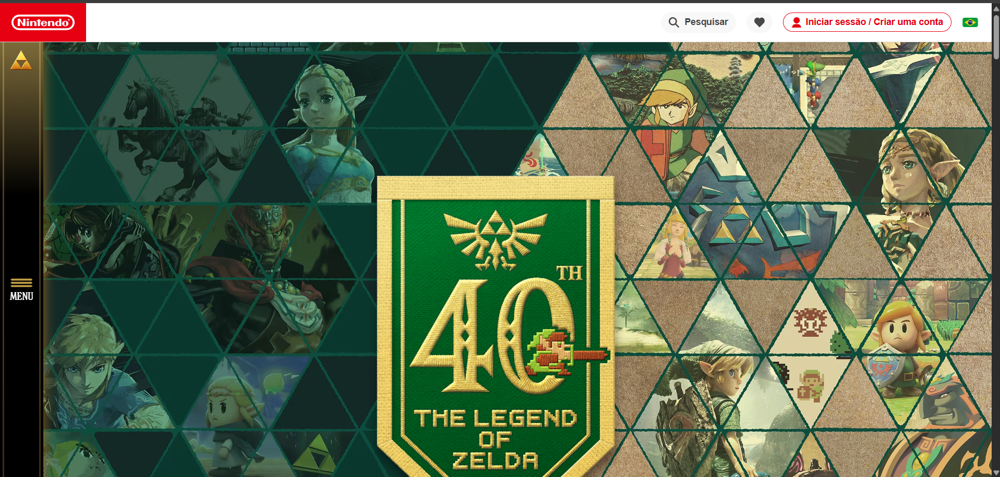
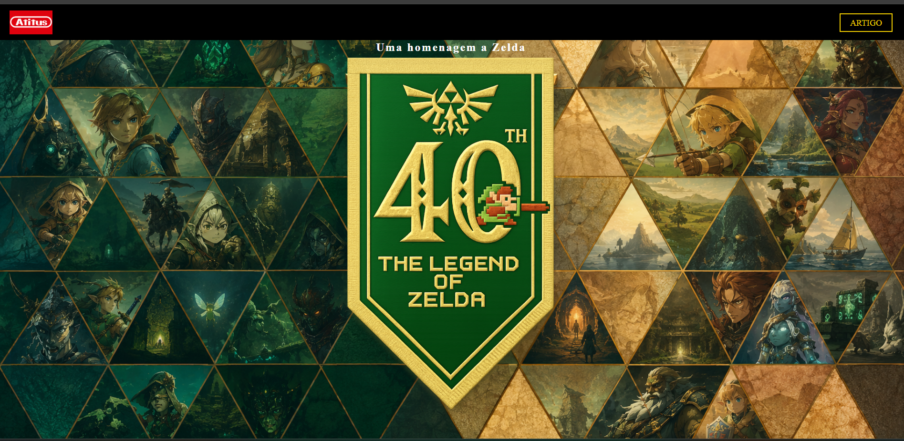
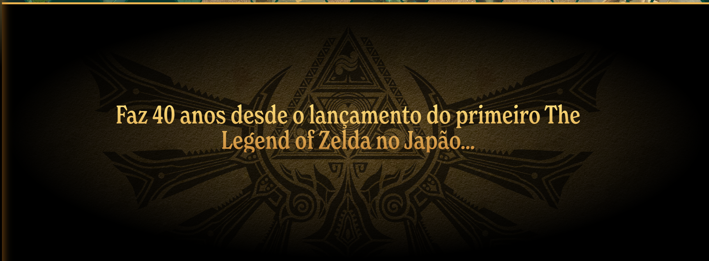
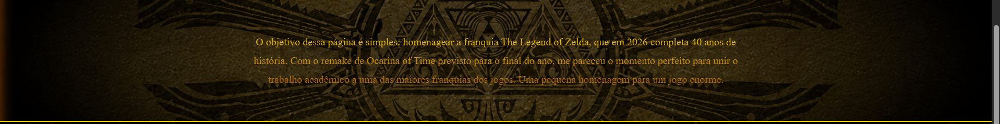
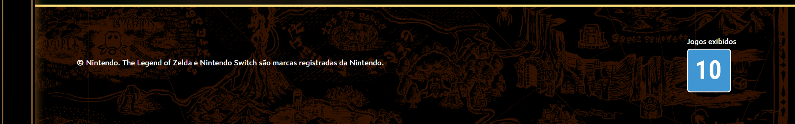
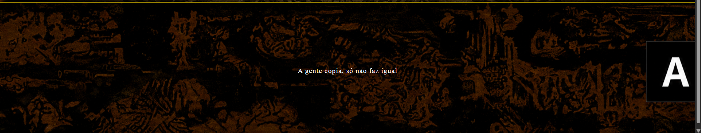

# The Legend of Zelda — 40 anos

**Nome:** Antonio Carlos Portella Vancini  
**Matrícula:** 1139402  
**Site de referência:** [nintendo.com/pt-br/explore/characters/zelda](https://www.nintendo.com/pt-br/explore/characters/zelda/)

---

## Sobre o projeto

Página desenvolvida como trabalho da disciplina de Front-End, tendo como referência visual a página oficial da Nintendo dedicada à personagem Zelda. O tema escolhido foi a comemoração dos 40 anos da franquia The Legend of Zelda, que em 2026 completa quatro décadas de história.

---

## Comparação com o site original

### Tela Superior (Cabeçalho / Hero)
| Site Original | Meu resultado |
|---|---|
|  |  |

### Tela do Meio (Conteúdo)
| Site Original | Meu resultado |
|---|---|
|  |  |

### Rodapé
| Site Original | Meu resultado |
|---|---|
|  |  |

---

## Justificativas de diferenças

- **Fonte:** O site original utiliza fontes proprietárias da Nintendo. Foi utilizada a fonte padrão do navegador como substituta equivalente gratuita.
- **Interatividade:** O site original possui carrosséis e menus dinâmicos com JavaScript pesado. O projeto foca na estrutura estática, sem dependência de JS, exceto pelo comportamento simples do formulário de newsletter.
- **Conteúdo adicional:** Foram adicionadas seções extras não presentes na referência original: um artigo completo sobre os 40 anos da franquia, uma newsletter com confirmação temática e um rodapé autoral. Essas adições compõem o critério de personalização.
- **Imagens:** Algumas imagens do site original são protegidas por direitos autorais. Foram utilizadas imagens temáticas de Zelda disponíveis publicamente.

---

## Checklist de Requisitos — Parte 1

### 1.1 Estrutura HTML semântica e acessível

- [x] `<header>` — usado para o cabeçalho com logo e navegação
- [x] `<nav>` — envolve o link de navegação dentro do header
- [x] `<main>` — delimita o conteúdo principal em todas as páginas
- [x] `<section>` — utilizado para as seções `.hero` e `.sobre`
- [x] `<article>` — utilizado na página de artigo para o conteúdo editorial
- [x] `<footer>` — rodapé com imagem temática e frase autoral
- [x] Todas as imagens com `alt` descritivo; imagem de fundo decorativa com `alt=""`
- [x] Formulário acessível com `<label>` associado a cada campo (newsletter no artigo)

**Análise da página de referência (nintendo.com/zelda):**  
A página original da Nintendo utiliza `<header>` para a barra de navegação global, `<main>` para o conteúdo central e `<footer>` para links institucionais. As imagens possuem atributos `alt`, e os formulários de busca utilizam `<label>` associados via `for/id`. A estrutura semântica é bem aplicada, com uso de `<nav>` para os menus principais e `<section>` para separar blocos de conteúdo como personagens e jogos.

---

### 1.2 Fidelidade visual à referência

- [x] Paleta de cores escura com destaque em dourado/amarelo, semelhante ao tema visual da Nintendo para Zelda
- [x] Organização geral com cabeçalho fixo, seção hero com imagem de fundo, conteúdo central e rodapé
- [x] Imagem de fundo cobrindo a hero section com `object-fit: cover`
- [ ] Tipografia idêntica — fonte proprietária da Nintendo substituída pela fonte padrão do navegador

---

### 1.3 CSS: seletores, box model e variáveis

- [x] Seletores de classe — `.navbar`, `.hero`, `.sobre`, `.footer`, `.artigo`
- [x] Seletores descendentes — `.navbar img`, `.hero-logo h1`, `.hero-logo img`, `.newsletter-form label`
- [x] Pseudo-classes — `.btn-duvidas:hover`, `.newsletter-form button:hover`
- [x] Variáveis CSS — definidas no `:root`: `--cor-amarelo`, `--cor-amarelo-escuro`, `--cor-fundo`, `--cor-fundo-claro`, `--cor-texto`, `--altura-navbar`
- [x] Box model — uso de `padding`, `margin`, `box-sizing: border-box` em múltiplos elementos

---

### 1.4 Responsividade: Flexbox, Grid e mobile first

- [x] CSS escrito mobile first — estilos base pensados para telas pequenas (logo `70vw`, padding reduzido, fontes menores)
- [x] Flexbox — utilizado em `.navbar`, `.hero-conteudo`, `.hero-logo`, `.newsletter-form`
- [x] CSS Grid — utilizado no `.footer` para sobrepor a imagem de fundo e o texto na mesma célula do grid, sem `position: absolute`
- [x] Media query com `min-width: 768px` — ajusta logo para `29vw`, aumenta padding da seção `.sobre` e aumenta tamanhos de fonte para desktop
- [x] Layout funcional em desktop e celular

---

### 1.5 Personalização e originalidade

- [x] Seção `.sobre` com texto original explicando o propósito do projeto
- [x] Página de artigo (`artigo.html`) com conteúdo editorial completo sobre os 40 anos da franquia, não presente na referência original
- [x] Newsletter com confirmação temática: "A Triforce iluminou seu caminho, viajante"
- [x] Rodapé com frase autoral: "A gente copia, só não faz igual"
- [x] Borda dourada separando as seções, inspirada na identidade visual da franquia
